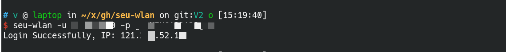

## seu-wlan V2

seu-wlan 是帮助自动登录东南大学校园网并防止掉线的小工具

### Requirements

* Python 3.6+
* requests

### Installation

```sh
pip3 install requests --user
git clone https://github.com/higuoxing/seu-wlan.git
```

### Usage
```
usage: seu-wlan [-h] -u USERNAME -p PASSWORD [-t TIMEOUT] [-i ISP] [-l LINK] [-r] [-m MAC]

Login to SEU-WLAN automatically.

optional arguments:
  -h, --help            show this help message and exit
  -u USERNAME, --username USERNAME
                        username
  -p PASSWORD, --password PASSWORD
                        password
  -t TIMEOUT, --timeout TIMEOUT
                        HTTP timeout
  -i ISP, --ISP ISP     ISP, c: 中国移动(cmcc), t: 中国电信(telecom), u: 中国联通(unicom), empty or else: 校园网
  -l LINK, --link LINK  redirect link, for example: http://10.80.128.2/a79.htm?UserIP=10.208.25.1&wlanacname=
  -r, --relogin         try to log out first then log in, requires -l
  -m MAC, --mac MAC     MAC address, mainly used in unbind_mac
```

`ISP` 留空即为校园网登录

`link` 选项用于无法获取跳转登录链接时，直接填写已知跳转链接

`-r` 选项用于重新登录，用于必须重新登录才能恢复正常网速的情况

### Screenshot


