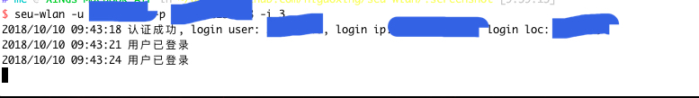

seu-wlan
=========

.. image:: https://goreportcard.com/badge/github.com/higuoxing/seu-wlan

seu-wlan 是帮助自动登录东南大学校园网并防止掉线的小工具

Requirements
------------
Go 1.11

Installation
------------
``$ go get github.com/Higuoxing/seu-wlan``

Usage
-----
``usage: seu-wlan -u username -p password [-i seconds] [-m 0|1]``

positional arguments:
  -u                      一卡通号码
  -p                      统一认证密码

optional arguments:
  -i                      设置轮询登录间隔，以秒为单位 (int)
  -m                      设置是否允许记住 mac 地址 (1|0)
  -c                      如不想使用明文密码，可以使用配置文件

Configuration
-------------
参见 ``config.json``

Screenshots
-----------

